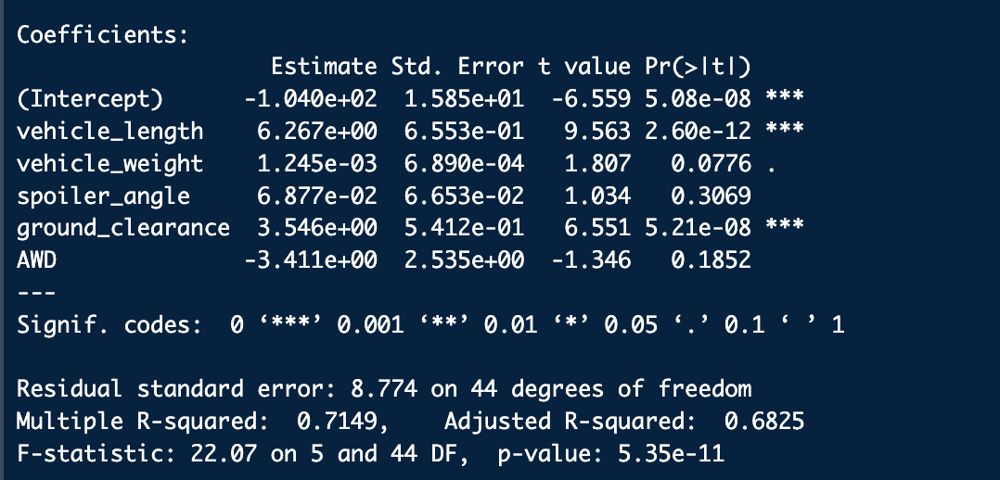
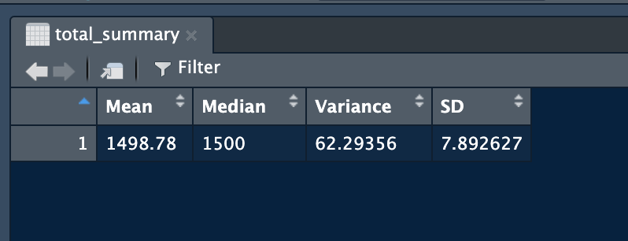
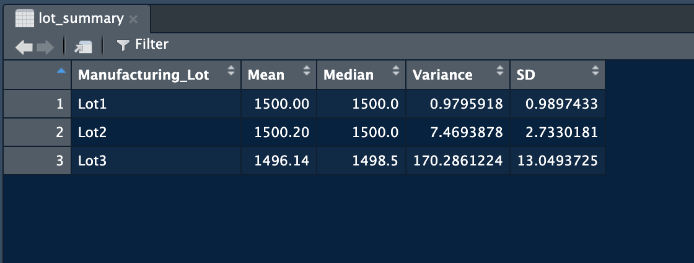
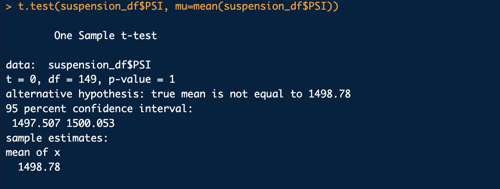
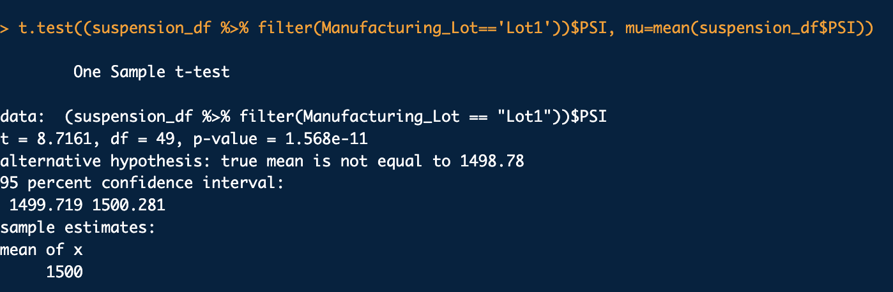
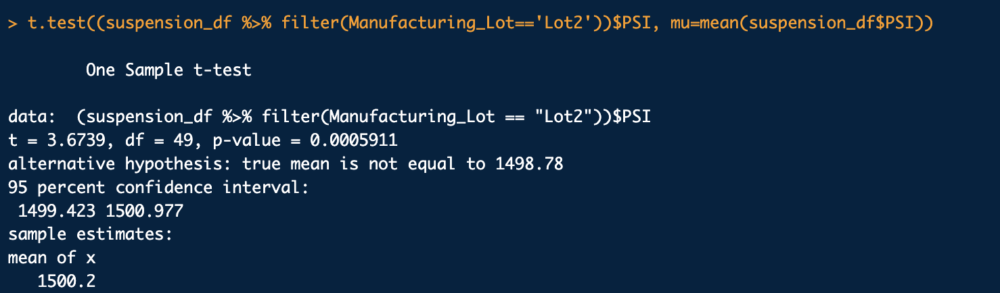
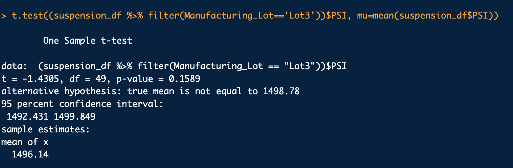

# MechaCar_Statistical_Analysis

Data Bootcamp Week 16- R and RStudio

## Overview of Analysis
The purpose of this analysis is to help a data analytics team do the following: 

-Perform multiple linear regression analysis to identify which variables in the dataset predict the mpg of MechaCar prototypes.
-Collect summary statistics on the pounds per square inch (PSI) of the suspension coils from the manufacturing lots.
-Run t-tests to determine if the manufacturing lots are statistically different from the mean population.
-Design a statistical study to compare vehicle performance of the MechaCar vehicles against vehicles from other manufacturers. For each statistical analysis, you’ll write a summary interpretation of the findings.

## Linear Regression to Predict MPG

The above linear regression model depicts our response variable is mpg and our predictable variables are vehicle length, vehicle weight, spoiler angle, ground clearance, and AWD. Based on the data, the vehicle length and ground clearance are the main variables contributing to the prototype's mpg performance. The slope of the linear model is not zero because the p-value of 5.35e-11. The r-squared and p-value determines that this model does predict the mpg of MechaCar prototypes effectively.

## Summary Statistics on Suspension Coils

The design specifications for the MechaCar suspension coils dictate that the variance of the suspension coils must not exceed 100 pounds per square inch. The current manufacturing data does meet this design specification for all manufacturing lots in total and each lot individually with the exception of Lot 3 where it exceeds the threshold. 

## T-Tests on Suspension Coils

To briefly summarize, the mean of all the lots is less than 1500, so the hypothesis is true.

## Study Design: MechaCar vs Competition

This statistical study analyzed whether or not AutosRUs’ newest prototype, the MechaCar, competes against other similar products. MechaCar is suffering from production troubles that are blocking the manufacturing team’s progress. The null hypothesis would be that consumers would prefer to purchase a vehicle based on looks instead of performance. An alternate hypothesis can look at do consumers thoroughly research before purchasing a vehicle. The lm() function and t-test would help test the null and alternate hypotheses. 

